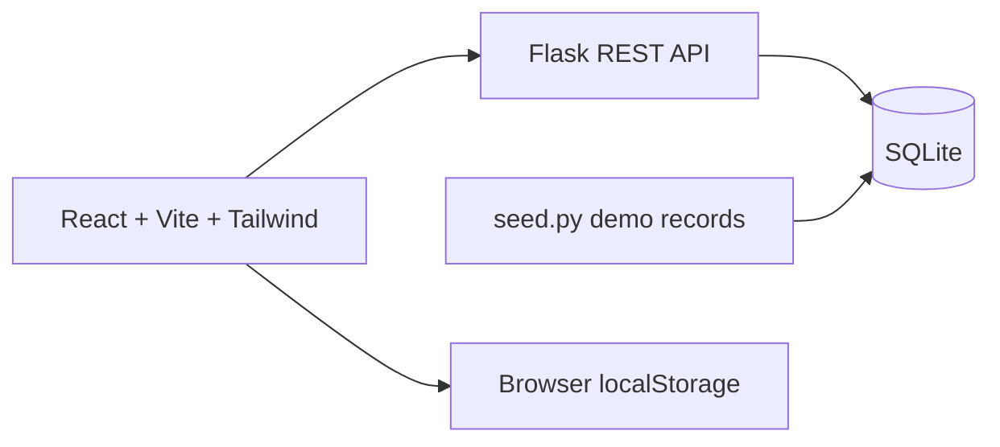

# StudySpots

A café discovery prototype for choosing a place to study, work, or meet friends. A React interface pairs amenity filters and café detail pages with a Flask REST API and a small SQLite demo dataset.

## Features

- Search by café name, city, or address.
- Filter for Wi-Fi, outlets, quiet spaces, parking, groups, cozy spaces, and late hours.
- Browse featured cafés and detail pages with photos, amenities, ratings, and reviews.
- Save favorites in browser storage and submit reviews to the API.
- Switch between a card grid and an illustrative map panel.

## Architecture



## Run locally

```bash
git clone https://github.com/OmElMon/StudySpots.git
cd StudySpots/backend
python3 -m venv .venv
source .venv/bin/activate
pip install -r requirements.txt
python seed.py
python app.py
```

On Windows, activate with `.venv\Scripts\activate` instead. The API listens on port 5001. **The seed command deletes and replaces all cafés and reviews in the local database.**

In a second terminal:

```bash
cd StudySpots/frontend
npm ci
npm run dev
```

Open [localhost:5173](http://localhost:5173). Set `VITE_API_BASE` to change the default API base, `http://localhost:5001/api`.

## API

| Method | Route | Purpose |
| --- | --- | --- |
| GET | `/api/health` | Service health |
| GET | `/api/cafes` | Search and filter |
| GET | `/api/cafes/featured` | Featured records |
| GET | `/api/cafes/<id>` | Details with reviews |
| GET / POST | `/api/cafes/<id>/reviews` | Read / add reviews |

```bash
curl "http://localhost:5001/api/cafes?city=Seattle&quiet=true&wifi=true&outlets=true"
```

The late-hours filter key is `openLate`. Filters are combined by the backend and results are sorted by study score and hangout rating.

## Validation and limits

The repository provides `npm run build` and `npm run preview` in `frontend/`, but has no automated test suite or GitHub Actions runs at the time of this documentation audit. Installation and end-to-end operation have not been rerun for this README update.

The dataset contains six demo café records with stored study scores. Scores are not calculated dynamically. The map positions markers by array index rather than geographic coordinates; café coordinates are available for a future map integration. “Near me” bypasses the city filter and does not use browser geolocation. Reviews have no user authentication or moderation, and numeric rating validation needs further work before public use.

No live deployment or license file is included in the repository.
